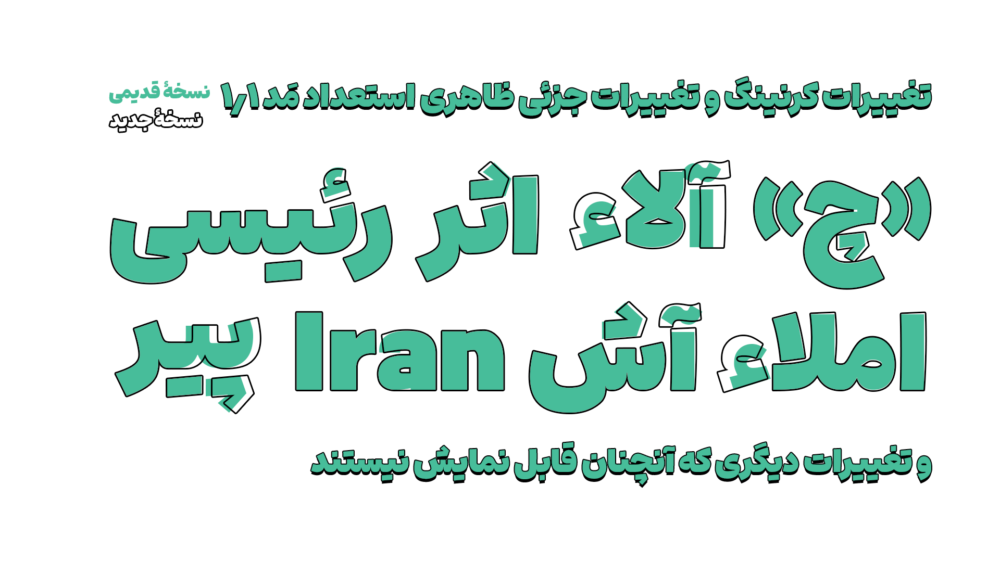

# Estedad Mad Changelog

## ۱,۱

۶ مهر ۱۴۰۳
- تغییر جزئی طراحی بسیاری از حروف
- - تغییر اندازۀ نقاط بعضی حروف
- - تغییر فاصله از کنار بعضی حروف
- - تغییر کلاهک «آ»
- - تغییر جزئی ظاهر تمامی الف ها، لام ها، و الف‌لام ها
- - تغییر شکل جزئی همزه
- - و تغییرات جزئی دیگر
- تغییر اندازۀ فونت
- حذف بعضی از حروف بی‌استفاده
- حذف هینتینگ
- بهینه‌سازی کرنینگ ها
- اضافه کردن گلیف های مربوط به فاصله های خاص، یا نیم‌فاصله
- اصلاح یونیکد حرف «چ»
- تغییر جزئی بعضی حروف انگلیسی، برای هماهنگی بیشتر با حروف فارسی
- اضافه شدن نسخه های «بدون انگلیسی» و «اعداد فارسی»
- اضافه شدن سورس فونت

## ۱.۰
۹ تیر ۱۴۰۳

استعداد مَد منتشر شد.

برای مشاهده تاریخچه فونت استعداد مَد به [این صفحه](https://github.com/MDarvishi5124/Estedad-Mad/CHANGELOG.md) مراجعه نمایید.
