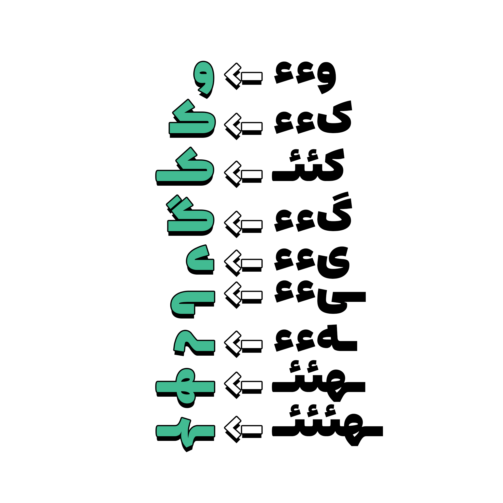

# Estedad Mad | استعداد مَد

استعداد مَد یک فونت مخصوص تیترها و عنوان‌هاست که بر اساس فونت [استعداد](https://github.com/aminabedi68/Estedad) طراحی شده است. استعداد مَد ضخیم‌تر از استعداد است و ویژگی‌هایی در آن پیاده‌سازی شده تا بتواند در تیترها بدرخشد و توجه‌ها را به خود جلب کند. استعداد مَد شخصیت سبکی دارد و برای موضوعات مربوط به سرگرمی و... فونت مناسبی به شمار می‌رود.

## Masters

استعداد مَد تعدادی جایگزین اختیاری دارد که به‌راحتی در همۀ محیط‌های نرم‌افزاری قابل‌استفاده است و در صورت علاقه داشتن می‌توانید از آنها استفاده کنید.
